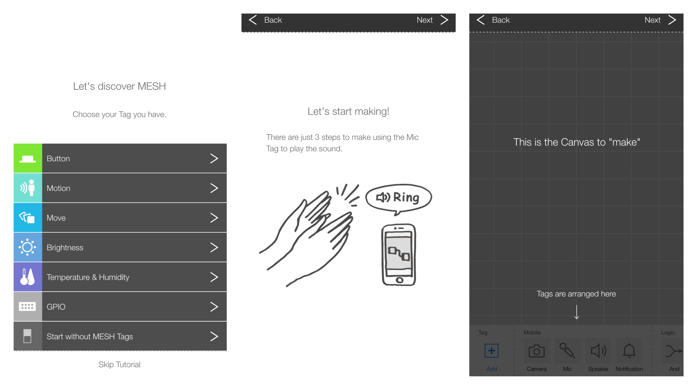
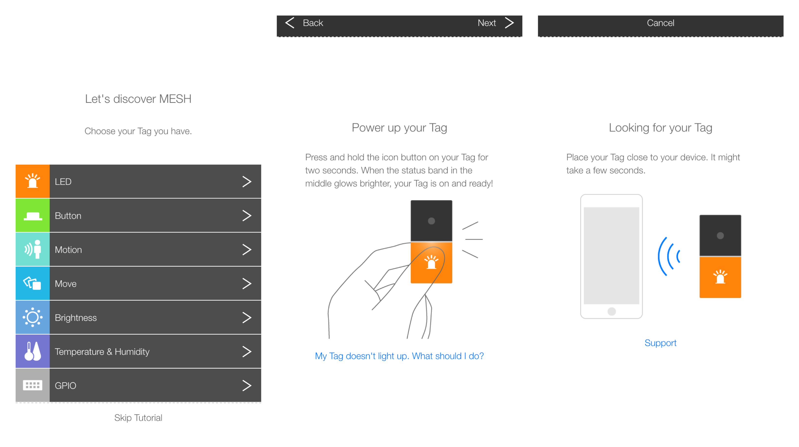
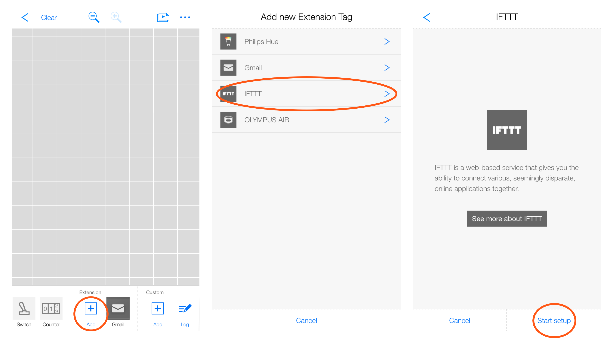
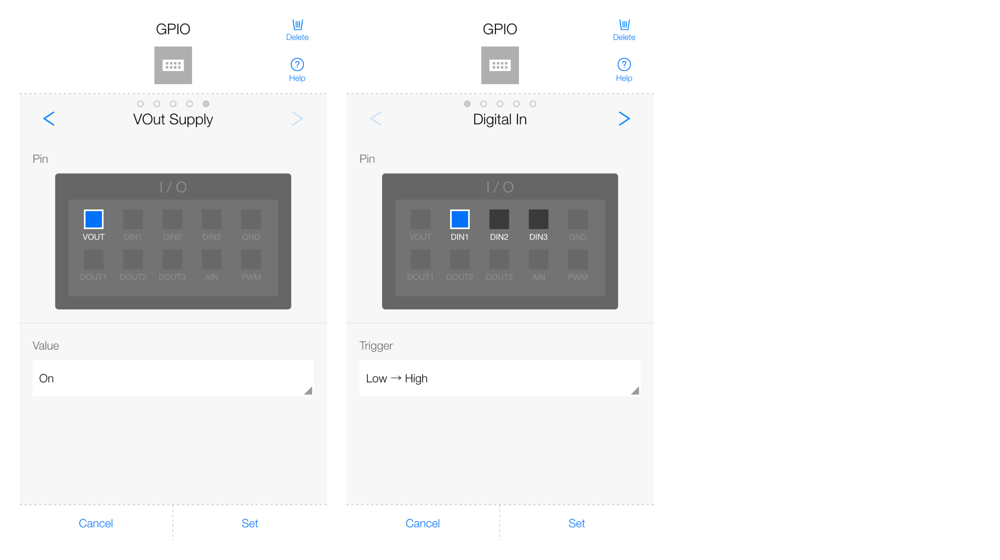

# Prototyping IoT Applications with MESH and IFTTT

In this course, you’ll learn ways to utilize MESH and IFTTT, simple yet powerful tools let you prototype IoT projects. You’ll also learn a basic concept of IoT (Internet of Things) by example.

## Materials

* MESH Tags: 1 set (7 tags, should be fully charged)
* Grove Bridge for MESH GPIO Tag: 1
* Grove modules: 1 set
  * [Grove - Touch Sensor](http://www.seeedstudio.com/wiki/Grove_-_Touch_Sensor): 1
  * [Grove - Sound Sensor](http://www.seeedstudio.com/wiki/Grove_-_Sound_Sensor): 1
  * [Grove - Vibration Motor](http://www.seeedstudio.com/wiki/Grove_-_Vibration_Motor): 1
  * Grove cables: 2
* iPhone, iPad or iPod touch (see [Which devices are compatible with the MESH?](http://support.meshprj.com/hc/en-us/articles/212601267-Which-devices-are-compatible-with-the-MESH-)): 1
* MESH design pattern cards: 1 set

## Getting started with MESH

### What is [MESH](https://meshprj.com/en/)?

* A tool that let you explore the world of IoT (Internet of things) using everyday objects
* Consisting of the MESH App and the MESH Tags
* Various MESH Tag are available:
  * LED Tag: a multiple color LED
  * Button Tag: an input device that allows you to create your own switch
  * Motion Tag: an input device that detects moving people and even animals
  * Move Tag: detects motion patterns
  * Brightness Tag: an input device that detects and notifies you about a change in brightness
  * Temperature & Humidity Tag: an input device that can detect a change in temperature or humidity
  * GPIO Tag: has a digital and analog input/output that connects other sensors or actuators
* With MESH, you can:
  * Connect to various internet services (i.e. Gmail and IFTTT)
  * Connect to various wireless devices (i.e. Philips Hue and Olympus Air)
  * Control functions on your iPhone, iPad or iPod touch (e.g. camera, speaker, microphone and notification)

### Try

* Tutorial > Start without MESH Tags  
  
* Add a MESH Tags and follow a tutorial to learn (Note: please move slightly away from each other for the avoidance of confusion and confirm ID to make sure)  
  
* Detect a button press with a Button Tag and give a feedback by the light of a LED Tag
* Detect a motion with a Motion Tag and give a feedback by the light of a LED Tag 
* Demo
* Turn on Philips Hue LED lamps when darken up (with a Brightness Tag)

## Getting started with IFTTT

### What is IFTTT?

### Getting started with IFTTT

1. Point your web browser to https://ifttt.com/ and create an account
2. Install an application for your smartphone (iOS or Android)
3. Create a recipe to get familiar with IFTTT terms (e.g. recipes, channels, triggers, actions and so on)

### Try

1. Create a recipe by choosing from examples
2. Create a recipe from scratch
3. Add an IFTTT Tag on your canvas and try with a Tag and create a recipes using MESH as a trigger or an action  
  

## How to play with GPIO Tag?

* What the GPIO Tag can do?
  * Digital In
  * Digital Out
  * Analog In
  * PWM Out
  * VOut Supply
* Try
  * Detect touches (with Grove - Touch Sensor)  
    
  * Give feedback with vibration (with Grove - Vibration Motor)

## Make 

* Theme: create a simple IoT project with cardboards, Grove modules, MESH Tags and IFTTT
* Time limit: 45 minutes

## Review

* Presentation: 7 teams
* Tell a story about your project
* Wrap-up
